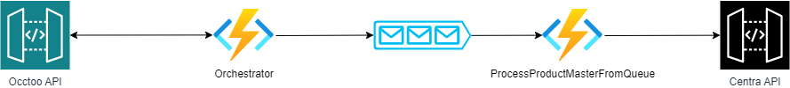

# Centra Formatter 
This project gives an example on how to create a formatter for Centra using Occtoo APIs 

**Docs:** https://docs.occtoo.com/

The solution has functions working as shown below:



Orchestrator – is called each two minutes and depending on the state of the finite-state machine calls Occtoo API and fills the queue

ProcessProductMasterFromQueue (QueueTrigger) – 
Loads flatten SKU list for specific productMaster, create product hierarchy necessary for import process and import product (variants, SKUs) into Centra DB 

## Running the app
### 1. Get the code
Clone the repository and open the solution
### 2. Add a localsettings.json file and fill out the details of your project
```json
{
  "IsEncrypted": false,
  "Values": {
    "AzureWebJobsStorage": "UseDevelopmentStorage=true",
    "FUNCTIONS_WORKER_RUNTIME": "dotnet",
    "ApplicationName": "",
    "EnvironmentToken": "",
    "EnvironmentUrl": "https://[YOURCOMPANY].centraqa.com/graphql",
    "ProductMasterQueue": "productmaster-queue-prod",
    "OcctooUrl": "",
    "OcctooUrlToken": "",
    "OcctooClientId": "",
    "OcctooClientSecret": ""
  }
}
```

### 3. Start the application
Hit F5